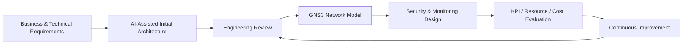
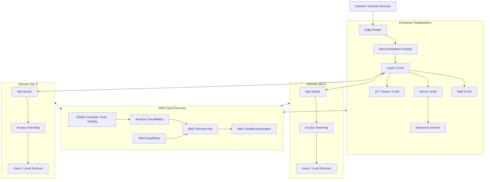
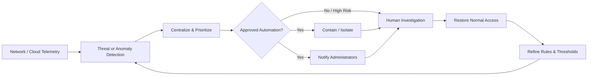

# AI-Enhanced Enterprise Network Operations & Security

## Overview

This repository presents a sanitized architecture case study for modernizing a fragmented multi-site enterprise network with AI-assisted monitoring, scalable cloud services, centralized security visibility, automated incident response, and data-driven capacity planning.

The design demonstrates a practical engineering workflow:

1. Use an AI-supported design process to create an initial enterprise architecture.
2. Review the proposed topology against business, networking, security, and operational requirements.
3. Refine the architecture into a more realistic GNS3 model.
4. Define measurable performance and security KPIs.
5. Add cloud-based monitoring, threat detection, and response automation.
6. Evaluate resource consumption, operating cost, and expected business value.
7. Establish a continuous-improvement loop so automation rules and capacity plans evolve with the environment.

> **Project scope:** architecture, network modeling, security-operations design, and performance/cost analysis. This repository does not claim that the complete environment or projected improvements were deployed and measured in production.

---

## Business Challenge

A growing organization has acquired two additional sites that use different network technologies and operating practices. The resulting environment has several common enterprise problems:

- Fragmented site networks
- Inconsistent security policies
- Manual monitoring and troubleshooting
- Limited centralized visibility
- Different server and network configurations
- Increasing cybersecurity risk
- Growing demand for cloud services and remote access
- Need to support additional users, applications, and locations
- Difficulty predicting future capacity requirements

The modernization objective is to create one manageable enterprise architecture that connects all locations securely while using automation and analytics to improve operations.

---

## Design Method: AI Proposal → Engineering Validation → GNS3 Refinement

The initial topology was produced with an AI-supported design process. Rather than treating AI output as authoritative, the design was reviewed and refined against real networking constraints.

### Human Validation Remains Essential

AI-assisted architecture can accelerate ideation, but proposed designs should still be checked for:

- Routing feasibility
- Addressing and subnet consistency
- VLAN boundaries
- Device placement
- Security-zone design
- Redundancy and failure domains
- Cloud-service suitability
- Capacity requirements
- Cost implications
- Operational supportability

This project treats AI as an engineering assistant—not a replacement for validation.

---

## Target Enterprise Architecture

The public diagram is an original portfolio abstraction of the design concepts rather than a reproduction of institution-provided diagrams or assessment screenshots.

---

## Network Design Principles

### Multi-Site Connectivity

The architecture consolidates headquarters and acquired locations into a controlled enterprise design with defined routing and security boundaries.

### VLAN Segmentation

Logical segmentation separates different workload and trust categories such as:

- Staff systems
- Server infrastructure
- IoT or specialized devices
- Management services
- Site-specific resources

Segmentation limits broadcast domains, improves manageability, and supports more precise security policy enforcement.

### Layer 3 Core

A Layer 3 core provides centralized routing between approved network segments while allowing access-control and monitoring policies to be applied at logical boundaries.

### Next-Generation Firewall

The firewall layer provides application-aware policy enforcement and complements cloud-based monitoring and threat-detection services.

---

## Scalability Strategy

### Horizontal Scaling

The architecture supports growth by allowing additional:

- Compute instances
- Application servers
- Network devices
- User segments
- Remote facilities
- Cloud workloads

Elastic cloud resources can increase or decrease based on demand instead of requiring permanent overprovisioning.

### Vertical Scaling

Existing workloads can be assigned additional processing, memory, or storage when a service cannot yet scale horizontally.

### Resource Management

The design combines:

- Elastic resource allocation
- Load balancing
- Automated utilization monitoring
- Predictive capacity planning
- Threshold-based alerting
- Regular performance review

The goal is to identify capacity pressure before users experience degradation.

---

## AI-Assisted Security Operations

The security design combines network controls with centralized cloud telemetry and automation.

### Monitoring and Threat Detection

**Amazon CloudWatch** collects performance and operational telemetry that can be used for threshold alerts, dashboards, and capacity analysis.

**AWS GuardDuty** contributes managed threat detection and anomaly analysis across supported AWS data sources.

**AWS Security Hub** centralizes security findings so analysts can prioritize events from a common view.

**Next-generation firewall controls** add network and application-layer enforcement at the enterprise boundary.

### Layered Detection

The overall strategy can combine multiple detection approaches:

- Known-pattern and signature detection
- Behavioral and anomaly detection
- Heuristic analysis
- Threat-intelligence correlation
- Sandboxed or isolated analysis for suspicious content where supported

Layered detection is important because no single technique reliably identifies every threat category.

---

## Automated Incident Response

The design uses automation to shorten the time between detection and containment while preserving human oversight for high-impact decisions.

### Example Automated Response Mechanisms

Depending on severity and pre-approved playbooks, automation may:

- Modify a security group to isolate a compromised cloud workload
- Block suspicious communication paths
- Disable or restrict compromised credentials
- Generate administrator notifications
- Create an incident for investigation
- Preserve relevant telemetry for later review

Automation should be bounded by policy, logging, testing, and rollback procedures.

---

## Performance and KPI Framework

The case study used KPI targets and projected comparisons to evaluate whether AI-assisted operations could provide measurable value.

### Example Operational KPIs

| KPI | Why It Matters |
|---|---|
| Network availability | Measures service reliability |
| Average latency | Tracks responsiveness between sites and services |
| Throughput | Measures usable network capacity |
| Packet loss | Identifies network-quality problems |
| Fault recovery time | Measures operational resilience |
| Mean time to respond | Measures incident-response efficiency |
| Threat-detection accuracy | Evaluates security-monitoring quality |
| Resource utilization | Identifies capacity constraints and waste |
| Backup success rate | Supports recovery readiness |
| User satisfaction | Connects infrastructure quality to user experience |

### Illustrative Assessment Scenario

The academic scenario modeled possible improvements such as higher throughput and availability, lower latency and packet loss, shorter recovery time, and faster security response. These figures were **planning assumptions used for comparative analysis**, not production measurements.

A real deployment would require a baseline period followed by controlled post-deployment measurement before claiming improvement.

---

## Continuous Monitoring and Improvement

AI-driven operations should not be treated as a one-time installation.

A post-deployment operating model should:

1. Establish baselines for latency, throughput, availability, utilization, and incident response.
2. Review dashboards and alerts continuously.
3. Track false positives and missed detections.
4. Compare actual scaling events with forecast demand.
5. Tune thresholds and automated response rules.
6. Validate that automation produces the intended result.
7. Review capacity before major business growth or site expansion.
8. Reassess cloud cost and resource allocation regularly.

This creates a feedback loop in which monitoring results drive the next engineering improvement.

---

## AI-Assisted vs. Traditional Network Operations

| Traditional Approach | AI-Assisted / Automated Approach |
|---|---|
| Administrators manually inspect individual systems | Centralized telemetry highlights anomalies and trends |
| Capacity problems are often discovered after degradation | Trend analysis supports earlier capacity planning |
| Security events require manual correlation | Findings can be aggregated and prioritized centrally |
| Routine response steps are repeated manually | Approved playbooks automate repeatable containment steps |
| Static resource allocation | Elastic resources adjust to workload demand |
| Periodic review | Continuous telemetry enables ongoing evaluation |

AI assistance does not eliminate administrators. It changes where they spend their time: less repetitive event processing and more validation, architecture, risk management, and exception handling.

---

## Resource Utilization Impact

AI-assisted monitoring and automation introduce their own infrastructure demands.

### Memory and Processing

Continuous telemetry analysis, anomaly detection, and event correlation require additional compute and memory. Cloud-based analysis can reduce the amount of dedicated AI-processing infrastructure that must be maintained locally, but the processing still has a cost.

### Bandwidth

Logs, metrics, security events, and operational telemetry create additional network traffic. Collection should therefore use filtering, aggregation, retention policies, and secure transport rather than forwarding unlimited raw data indefinitely.

### Storage

Security logs and historical telemetry can grow quickly. Retention schedules and storage lifecycle policies help preserve required data while controlling long-term cost.

---

## Cost Optimization Strategy

A cost-aware implementation should combine:

- Auto Scaling and demand-based compute allocation
- Monitoring thresholds for over- and under-utilized resources
- Storage lifecycle policies
- Budget and cost-anomaly alerts
- Regular rightsizing reviews
- Removal or shutdown of unused resources
- Quality of Service for business-critical traffic
- Periodic review of automation effectiveness

Cloud automation can reduce operational effort, but poorly governed automation can also scale cost rapidly. Cost visibility therefore belongs inside the engineering feedback loop.

---

## Illustrative Business Case

The assessment included a hypothetical financial model to demonstrate cost-benefit analysis:

| Planning Metric | Illustrative Value |
|---|---:|
| Initial AI / automation investment | $150,000 |
| Projected annual operational savings | $180,000 |
| Illustrative first-year ROI | 20% |
| Illustrative payback period | 10–12 months |

These are **scenario estimates**, not realized savings from a production deployment.

The modeled benefits were tied to reduced downtime, less repetitive administration, faster incident response, and improved infrastructure utilization. A production business case would require actual licensing quotes, staffing assumptions, cloud consumption estimates, outage history, and measured labor savings.

---

## Evaluating AI Output

AI-generated network recommendations should be evaluated using a repeatable framework rather than accepted because they appear technically plausible.

### Suggested Review Framework

**1. Requirements Fit**  
Does the design satisfy business, security, performance, and growth requirements?

**2. Technical Validity**  
Are routing, addressing, segmentation, connectivity, and device roles realistic?

**3. Security Impact**  
Does the recommendation introduce unnecessary trust, privileges, or attack paths?

**4. Operational Supportability**  
Can administrators monitor, troubleshoot, recover, and maintain the design?

**5. Resource Impact**  
What compute, memory, bandwidth, storage, and licensing costs are introduced?

**6. Measurable Outcome**  
Which KPIs would verify that the recommendation actually improved the environment?

**7. Human Approval**  
High-risk configuration and containment decisions should remain subject to defined approval and audit controls.

---

## Skills Demonstrated

- AI-assisted network architecture design
- GNS3 network modeling and architecture refinement
- Enterprise routing and switching concepts
- VLAN segmentation
- Multi-site network integration
- AWS monitoring and security architecture
- Threat detection and security-event correlation
- Automated incident-response design
- Cloud scalability and resource management
- Performance KPI development
- Capacity planning
- Resource-utilization analysis
- Cost-benefit analysis
- Continuous monitoring and optimization
- Git/GitLab version-control workflow
- Technical communication for engineering and management audiences

---

## Future Enhancements

A production-oriented extension of this case study could add:

- Infrastructure as Code for the cloud monitoring stack
- Synthetic telemetry and alert-generation tests
- Example Lambda response functions using mock resources
- Security Hub automation rules
- CloudWatch dashboards and alarms
- A small reproducible GNS3 demonstration network built from original configurations
- Benchmark scripts for latency, throughput, and packet loss
- A KPI dashboard comparing baseline and post-change results
- Cost-estimation automation
- Automated rollback testing for response playbooks

---

## Academic Context

This portfolio project is derived from skills demonstrated in an academic network-automation and security scenario. The public repository has been rewritten and sanitized for professional portfolio use.

Institution-provided diagrams, assessment prompts, original submissions, grading materials, screenshots, and other school-specific artifacts are intentionally not reproduced here. The organization represented in this public case study is fictional, and projected performance or financial figures are identified as illustrative rather than production results.
